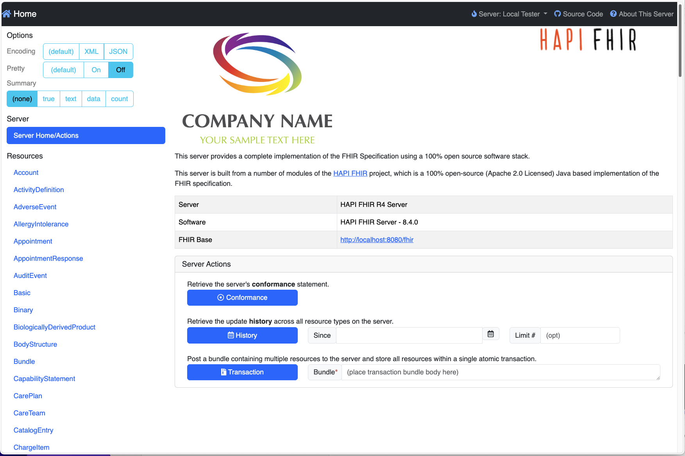
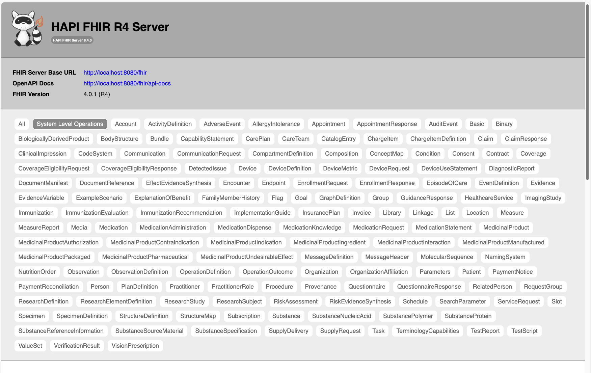
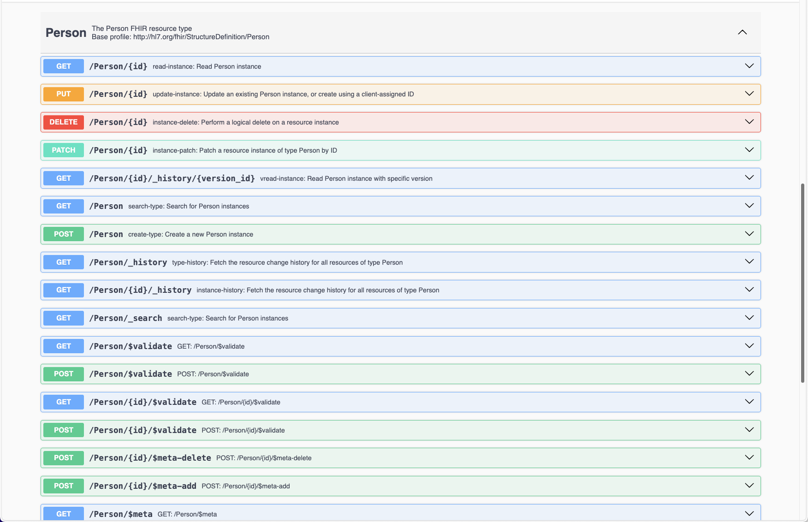

# Loading FHIR data in HAPI FHIR 

Pre-requisites: 
- Docker installed 
- [Synthetic patient data](1-synthea-dataset.md)


### 1. Run a local FHIR server (HAPI FHIR) with Docker

Run the server 

```bash
docker run -d --name hapi-fhir \
    -p 8080:8080 \
    -e hapi.fhir.version=r4 \
    hapiproject/hapi:latest
```

<br>

----------------


### 2. Check it's running 

You should be able to browse: 

- http://localhost:8080/ - simple web admin panel 
- http://localhost:8080/fhir - redirects to the Swagger UI 
- http://localhost:8080/fhir/metadata - returns JSON about resources, operations, etc








<br>

-------------------

### 3. Load data into the FHIR endpoint 

Assuming that you have [followed the previous step & generated some synthetic patient records](./1-synthea-dataset.md) using Synthea, you should have a `./output/fhir` folder in the base of your clone of the Synthea repository with patient data: 

```
# tree output 
output
├── fhir
│   ├── Alva958_Considine820_4e3ac4c6-ac75-9a88-9069-c01968c698d5.json
│   ├── Alvera113_Lorraine478_West559_e18d0e8c-1a27-6b4e-bb01-61d88cce1f2d.json
│   ├── Andrew29_Veum823_1824adab-d197-c784-34ab-93863d0aeef9.json
...
... etc 
```

You could try to load this into the FHIR server using a bash loop:  

```bash 
FHIR_BASE="http://localhost:8080/fhir"
for file in ./output/fhir/*.json; do
  echo "Uploading: $file"
  curl -sS -X POST \
    -H "Content-Type: application/fhir+json" \
    --data-binary @"$file" \
    "$FHIR_BASE"
done
```

**However**, it would likely return errors: 

> Invalid match URL \"Practitioner?identifier=http://hl7.org/fhir/sid/us-npi|9999863092\" - No resources match"

This is because the individual patient bundles reference practitioner and hospital data (collectively known as 'infrastructure bundles') which need to be uploaded first.  

Therefore, copy the included script `scripts/upload-fhir.sh` which will try to upload the infrastructure files first, then the patient data. 

<br>

----------------------------

### Debugging 

Check if the port is listening: 

```bash 
curl -v http://localhost:8080/
curl -v http://localhost:8080/fhir/metadata
```

Check the logs: 

```bash 
docker logs --tail=200 hapi-fhir
```

Check container stats: 

```bash 
docker stats hapi-fhir
```

Stop/restart the container: 

```bash 
docker stop hapi-fhir
docker restart hapi-fhir 
```

The most probably cause is Java OOM (out of memory) error.  

<br>

-----------------------------------

### Next steps 

To address possible Java OOM issues, and to avoid having to re-upload the patient data each time you recreate the docker container, consider [connecting HAPI FHIR to Postgres](./3-hapi-fhir-with-postgres.md) for persistence. 
