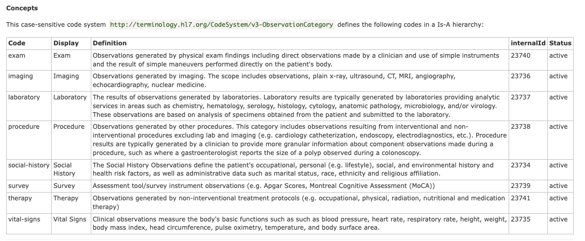

# Querying FHIR - familiarizing yourself with the API & codes 


## Observations 

The JSON returned from the HPAI FHIR '/fhir/Observation' endpoint, once deserialized is very similar for all search results: 

```python  
{
    'resourceType': 'Bundle',
    'id': 'e3defbe7-1a7c-4329-9aa4-57bf5cc31d5b',
    'meta': {'lastUpdated': '2025-10-09T07:04:58.270+00:00'},
    'type': 'searchset',
    'link': [
        {
            'relation': 'self',
            'url': 'http://localhost:8080/fhir/Observation?_count=1000&category='
        },
        {
            'relation': 'next',
            'url': 'http://localhost:8080/fhir?_getpages=e3defbe7-1a7c-4329-9aa4-57bf5cc31d5b&_getpagesoffset=1000&_count=1000&_pretty=true&_bundletype=searchset'
        }
    ],
    'entry': [
        ....       # <-- the actual results 
    ],
}
```

Considering a single search result: 

```python  
{
    'fullUrl': 'http://localhost:8080/fhir/Observation/64533',
    'resource': {
        'resourceType': 'Observation',
        'id': '64533',
        'meta': {
            'versionId': '1', 
            'lastUpdated': '2025-10-05T17:35:48.921+00:00'
        },
        'status': 'final',
        'category': [
            {
                'coding': [
                    {
                        'system': 'http://terminology.hl7.org/CodeSystem/observation-category',
                        'code': 'vital-signs',
                        'display': 'Vital signs'
                    }
                ]
            }
        ],
        'code': {
            'coding': [
                {
                    'system': 'http://loinc.org',
                    'code': '74006-8',
                    'display': 'Weight difference [Mass difference] --pre dialysis - post dialysis'
                }
            ],
            'text': 'Weight difference [Mass difference] --pre dialysis - post dialysis'
        },
        'subject': {
            'reference': 'Patient/60816'
        },
        'encounter': {
            'reference': 'Encounter/64532'
        },
        'effectiveDateTime': '2007-06-16T00:32:25+04:00',
        'issued': '2007-06-16T00:32:25.552+04:00',
        'valueQuantity': {
            'value': 2.7218,
            'unit': 'kg',
            'system': 'http://unitsofmeasure.org',
            'code': 'kg'
        }
    },
    'search': {
        'mode': 'match'
    }
}
```

Notice: 
1. in each Observation, the patient lives in `subject.reference` 
2. the `category` is a broad bucket for workflow/organization, using [HL7’s Observation Category code system](https://terminology.hl7.org/CodeSystem-v3-ObservationCategory.html)
3. the `code` in an observation is the the precise clinical concept measured, using [LOINC](https://loinc.org/get-started/what-loinc-is/). 


Note the types of Category codes (exam, imaging, laboratory, procedure social-history, survey, therapy, vital-signs); 



Reference: https://terminology.hl7.org/CodeSystem-v3-ObservationCategory.html


<br>

------------------

## Patients 

The individual patient can be retrieved using something like `GET /fhir/Patient/60816` 

```python 
{
    'resourceType': 'Patient',
    'id': '60816',
    'meta': {
        'versionId': '1',
        'lastUpdated': '2025-10-05T17:35:48.921+00:00',
        'profile': ['http://hl7.org/fhir/us/core/StructureDefinition/us-core-patient']},
        'text': {
            'status': 'generated',
            'div': '<div xmlns="http://www.w3.org/1999/xhtml">Generated by <a href="https://github.com/synthetichealth/synthea">Synthea</a>.Version identifier: master-branch-latest\n .   Person seed: -4677895842197393745  Population seed: 1759683556262</div>'
        },
        'extension': [
            {
                'url': 'http://hl7.org/fhir/us/core/StructureDefinition/us-core-race',
                'extension': [
                    {
                        'url': 'ombCategory',
                        'valueCoding': {
                            'system': 'urn:oid:2.16.840.1.113883.6.238',
                            'code': '2106-3',
                            'display': 'White'
                        }
                    },
                    {
                        'url': 'text', 
                        'valueString': 'White'
                    }
                ]
            },
            {
                'url': 'http://hl7.org/fhir/us/core/StructureDefinition/us-core-ethnicity',
                'extension': [
                    {
                        'url': 'ombCategory',
                        'valueCoding': {
                            'system': 'urn:oid:2.16.840.1.113883.6.238',
                            'code': '2186-5',
                            'display': 'Not Hispanic or Latino'
                        }
                    },
                    {
                        'url': 'text',
                        'valueString': 'Not Hispanic or Latino'
                    }
                ]
            },
            {
                'url': 'http://hl7.org/fhir/StructureDefinition/patient-mothersMaidenName',
                'valueString': 'Juana825 MacGyver246'
            },
            {
                'url': 'http://hl7.org/fhir/us/core/StructureDefinition/us-core-birthsex',
                'valueCode': 'M'
            },
            {
                'url': 'http://hl7.org/fhir/StructureDefinition/patient-birthPlace',
                'valueAddress': {
                    'city': 'Westwood Lakes',
                    'state': 'Florida',
                    'country': 'US'
                }
            },
            {
                'url': 'http://synthetichealth.github.io/synthea/disability-adjusted-life-years',
                'valueDecimal': 20.233188616012185
            },
            {
                'url': 'http://synthetichealth.github.io/synthea/quality-adjusted-life-years',
                'valueDecimal': 38.766811383987815
            }
        ],
        'identifier': [
            {
                'system': 'https://github.com/synthetichealth/synthea',
                'value': 'bf14c684-1d8c-2eaf-9913-a8ca73b2ecf6'
            },
            {
                'type': {
                    'coding': [
                        {
                            'system': 'http://terminology.hl7.org/CodeSystem/v2-0203',
                            'code': 'MR',
                            'display': 'Medical Record Number'
                        }
                    ],
                    'text': 'Medical Record Number'
                },
                'system': 'http://hospital.smarthealthit.org',
                'value': 'bf14c684-1d8c-2eaf-9913-a8ca73b2ecf6'
            },
            {
                'type': {
                    'coding': [
                        {
                            'system': 'http://terminology.hl7.org/CodeSystem/v2-0203',
                            'code': 'SS',
                            'display': 'Social Security Number'
                        }
                    ],
                    'text': 'Social Security Number'
                },
                'system': 'http://hl7.org/fhir/sid/us-ssn',
                'value': '999-99-7259'
            },
            {
                'type': {
                    'coding': [
                        {
                            'system': 'http://terminology.hl7.org/CodeSystem/v2-0203',
                            'code': 'DL',
                            'display': "Driver's license number"
                        }
                    ],
                    'text': "Driver's license number"
                },
                'system': 'urn:oid:2.16.840.1.113883.4.3.25',
                'value': 'S99952761'
            },
            {
                'type': {
                    'coding': [
                        {
                            'system': 'http://terminology.hl7.org/CodeSystem/v2-0203',
                            'code': 'PPN',
                            'display': 'Passport Number'
                        }
                    ],
                    'text': 'Passport Number'
                },
                'system': 'http://hl7.org/fhir/sid/passport-USA',
                'value': 'X74378815X'
            }
        ],
        'name': [
            {
                'use': 'official',
                'family': 'Simonis280',
                'given': ['Fredric73', 'Mario764'],
                'prefix': ['Mr.']
            }
        ],
        'telecom': [
            {
                'system': 'phone',
                'value': '555-145-6901',
                'use': 'home'
            }
        ],
        'gender': 'male',
        'birthDate': '1954-04-30',
        'deceasedDateTime': '2014-10-31T22:46:25+04:00',
        'address': [
            {
                'extension': [
                    {
                        'url': 'http://hl7.org/fhir/StructureDefinition/geolocation',
                        'extension': [
                            {
                                'url': 'latitude',
                                'valueDecimal': 28.867971470743647
                            },
                            {
                                'url': 'longitude',
                                'valueDecimal': -82.4761279022055
                            }
                        ]
                    }
                ],
                'line': ['861 Fisher Parade Apt 87'],
                'city': 'Lecanto',
                'state': 'FL',
                'postalCode': '34461',
                'country': 'US'
            }
        ],
        'maritalStatus': {
            'coding': [
                {
                    'system': 'http://terminology.hl7.org/CodeSystem/v3-MaritalStatus',
                    'code': 'M',
                    'display': 'Married'
                }
            ],
            'text': 'Married'
        },
        'multipleBirthBoolean': False,
        'communication': [
            {
                'language': {
                    'coding': [
                        {
                            'system': 'urn:ietf:bcp:47',
                            'code': 'en-US',
                            'display': 'English (United States)'
                        }
                    ],
                    'text': 'English (United States)'
                }
            }
        ]
    }
}
```

<br>

-------------------------

## Conditions 

Retrieving all conditions you would query just `/fhir/Condition` and receive a now-familiar looking Search result: 

```python 
{
    'resourceType': 'Bundle',
    'id': '3fac0728-a899-4079-89f9-7935af68e50a',
    'meta': {
        'lastUpdated': '2025-10-09T10:17:08.262+00:00'
    },
    'type': 'searchset',
    'link': [
        {
            'relation': 'self', 
            'url': 'http://localhost:8080/fhir/Condition'
        },
        {
            'relation': 'next',
            'url': 'http://localhost:8080/fhir?_getpages=3fac0728-a899-4079-89f9-7935af68e50a&_getpagesoffset=20&_count=20&_pretty=true&_bundletype=searchset'
        }
    ],
    'entry': [
        .....     # <-- the actual results 
    ]
}
```

To get the conditions for a particular patient, query `/fhir/Condition?subject=Patient/60816`

Note that not all "Conditions" are diseases/disorders... but some can be: 
- Findings (eg. smokes a pack of cigarettes a day)
- Situations (eg. history of appendectomy) 
- Social (eg. criminal record).   

These are tagged on `Condition.Code`.  For example mapping the result set to extract just the 'Code': 

```python
[
    {
        'coding': [
            {
                'system': 'http://snomed.info/sct',
                'code': '428251008',
                'display': 'History of appendectomy (situation)'
            }
        ],
        'text': 'History of appendectomy (situation)'
    },
    {
        'coding': [
            {
                'system': 'http://snomed.info/sct',
                'code': '1187604002',
                'display': 'Serving in military service (finding)'
            }
        ],
        'text': 'Serving in military service (finding)'
    },
    {
        'coding': [
            {
                'system': 'http://snomed.info/sct',
                'code': '224299000',
                'display': 'Received higher education (finding)'
            }
        ],
        'text': 'Received higher education (finding)'
    },
    {
        'coding': [
            {
                'system': 'http://snomed.info/sct',
                'code': '714628002',
                'display': 'Prediabetes (finding)'
            }
        ],
        'text': 'Prediabetes (finding)'
    },
    {
        'coding': [
            {
                'system': 'http://snomed.info/sct',
                'code': '271737000',
                'display': 'Anemia (disorder)'
            }
        ],
        'text': 'Anemia (disorder)'
    },
    {
        'coding': [
            {
                'system': 'http://snomed.info/sct',
                'code': '7200002',
                'display': 'Alcoholism (disorder)'
            }
        ],
        'text': 'Alcoholism (disorder)'
    },
    {
        'coding': [
            {
                'system': 'http://snomed.info/sct',
                'code': '449868002',
                'display': 'Smokes tobacco daily (finding)'
            }
        ],
        'text': 'Smokes tobacco daily (finding)'
    },
    {
        'coding': [
            {
                'system': 'http://snomed.info/sct',
                'code': '59621000',
                'display': 'Essential hypertension (disorder)'
            }
        ],
        'text': 'Essential hypertension (disorder)'
    },
    {
        'coding': [
            {
                'system': 'http://snomed.info/sct',
                'code': '431855005',
                'display': 'Chronic kidney disease stage 1 (disorder)'
            }
        ],
        'text': 'Chronic kidney disease stage 1 (disorder)'
    },
    {
        'coding': [
            {
                'system': 'http://snomed.info/sct',
                'code': '127013003',
                'display': 'Disorder of kidney due to diabetes mellitus (disorder)'
            }
        ],
        'text': 'Disorder of kidney due to diabetes mellitus (disorder)'
    },
    {
        'coding': [
            {
                'system': 'http://snomed.info/sct',
                'code': '431856006',
                'display': 'Chronic kidney disease stage 2 (disorder)'
            }
        ],
        'text': 'Chronic kidney disease stage 2 (disorder)'
    },
    {
        'coding': [
            {
                'system': 'http://snomed.info/sct',
                'code': '90781000119102',
                'display': 'Microalbuminuria due to type 2 diabetes mellitus (disorder)'
            }
        ],
        'text': 'Microalbuminuria due to type 2 diabetes mellitus (disorder)'
    },
    {
        'coding': [
            {
                'system': 'http://snomed.info/sct',
                'code': '162864005',
                'display': 'Body mass index 30+ - obesity (finding)'
            }
        ],
        'text': 'Body mass index 30+ - obesity (finding)'
    },
    {
        'coding': [
            {
                'system': 'http://snomed.info/sct',
                'code': '237602007',
                'display': 'Metabolic syndrome X (disorder)'
            }
        ],
        'text': 'Metabolic syndrome X (disorder)'
    },
    {
        'coding': [
            {
                'system': 'http://snomed.info/sct',
                'code': '433144002',
                'display': 'Chronic kidney disease stage 3 (disorder)'
            }
        ],
        'text': 'Chronic kidney disease stage 3 (disorder)'
    },
    {
        'coding': [
            {
                'system': 'http://snomed.info/sct',
                'code': '157141000119108',
                'display': 'Proteinuria due to type 2 diabetes mellitus (disorder)'
            }
        ],
        'text': 'Proteinuria due to type 2 diabetes mellitus (disorder)'
    },
    {
        'coding': [
            {
                'system': 'http://snomed.info/sct',
                'code': '266948004',
                'display': 'Has a criminal record (finding)'
            }
        ],
        'text': 'Has a criminal record (finding)'
    },
    {
        'coding': [
            {
                'system': 'http://snomed.info/sct',
                'code': '37320007',
                'display': 'Loss of teeth (disorder)'
            }
        ],
        'text': 'Loss of teeth (disorder)'
    },
    {
        'coding': [
            {
                'system': 'http://snomed.info/sct',
                'code': '201834006',
                'display': 'Localized, primary osteoarthritis of the hand (disorder)'
            }
        ],
        'text': 'Localized, primary osteoarthritis of the hand (disorder)'
    },
    {
        'coding': [
            {
                'system': 'http://snomed.info/sct',
                'code': '160903007',
                'display': 'Full-time employment (finding)'
            }
        ],
        'text': 'Full-time employment (finding)'
    }
]
```

Notice: 

1. in this case, these are [SNOMED codes](https://www.nlm.nih.gov/healthit/snomedct/index.html) 
2. it's possible to store both SNOMED and ICD in `Condition.code.coding[]` 


<br>

------------------------


## Advanced queries 

It is possible to perform filtering when querying the FHIR API. For example: 


### Filter with `_has`  

e.g. Patients with laboratory observations: 

```
GET /Patient?_has:Observation:subject:category=laboratory
```

e.g. Patients with a specific observation: 

```
GET /Patient?_has:Observation:subject:code=http://loinc.org|4548-4
```


### Specify fields with `_elements` 

If paging through responses, you may wish to reduce the attributes of each search result. 

e.g. Just the id, name, gender, date of birth: 

```
GET /Patient?_has:Observation:subject:category=laboratory&_elements=id,name,gender,birthDate&_count=200
```
